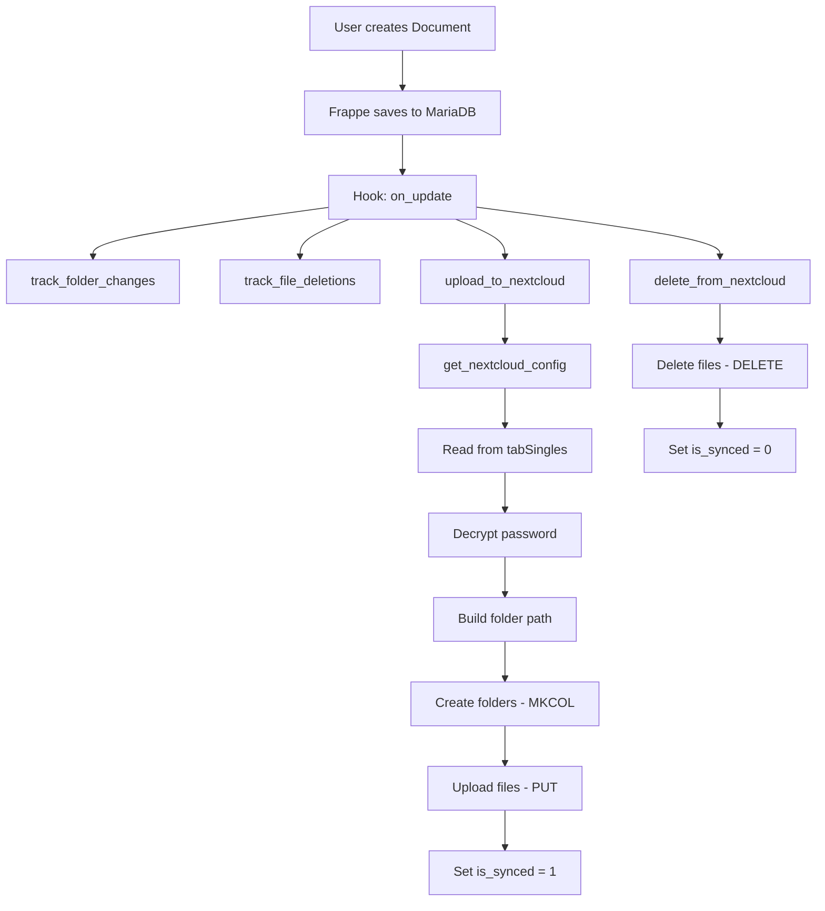

# 🏗️ Архитектура Company Documents App v0.0.2

**Версия:** v0.0.2  
**Дата:** 2025-11-20  
**Frappe:** version-15  
**ERPNext:** v15.83.0

---

## 1. Обзор проекта

**Company Documents App** - кастомное приложение для ERPNext, обеспечивающее:
- Управление документами с автоматической нумерацией
- Синхронизацию файлов с NextCloud через WebDAV
- Гибкую структуру папок (5 уровней)
- Связь документов с проектами и задачами

### Технический стек

| Компонент | Версия | Назначение |
|-----------|--------|------------|
| **Frappe Framework** | version-15 | Базовая платформа |
| **ERPNext** | v15.83.0 | ERP система |
| **HRMS** | v15.52.0 | Управление персоналом |
| **Raven** | v2.6.4 | Внутренний чат |
| **pibiDAV** | version-15 | WebDAV интеграция (базовый) |
| **Python** | 3.10+ | Язык программирования |
| **NextCloud** | latest | Облачное хранилище |

---

## 2. Структура файлов

```
company_documents/
├── __init__.py
├── hooks.py                           # Конфигурация приложения
├── nextcloud_sync.py                  # NextCloud интеграция (473 строки)
├── patches.txt                        # Миграции (пусто в v0.0.2)
├── modules.txt                        # Модули
│
├── fixtures/                          # Данные для установки
│   ├── doctype.json                   # 9 DocTypes
│   ├── server_script.json             # 5 Server Scripts
│   ├── client_script.json             # 7 Client Scripts
│   ├── folder_structure_template.json # 45 шаблонов
│   ├── custom_field.json              # Кастомные поля
│   ├── property_setter.json           # Настройки свойств
│   ├── document_naming_rule.json      # Правила нумерации
│   └── workspace.json                 # Воркспейсы
│
├── documents/                         # Модуль Documents
│   └── doctype/
│       ├── document/                  # DocType: Document
│       ├── document_file/             # DocType: Document File
│       ├── folder_structure_template/ # DocType: Folder Structure Template
│       └── nextcloud_sync_settings/   # DocType: NextCloud Sync Settings
│
├── projects/                          # Модуль Projects
│   └── doctype/
│       ├── task_document_link/        # DocType: Task Document Link
│       ├── project_document_type/     # DocType: Project Document Type
│       ├── task_employee/             # DocType: Task Employee
│       ├── cila_document_row/         # DocType: CILA Document Row
│       └── task_workspace_row/        # DocType: Task Workspace Row
│
├── templates/                         # Шаблоны
├── public/                           # Статические файлы
└── config/                           # Конфигурация
```

---

## 3. DocTypes (9 типов документов)

### 3.1 Основные DocTypes (5)

#### Document
**Тип:** Document  
**App:** company_documents  
**Модуль:** Documents  
**Назначение:** Основной DocType для хранения документов

**Ключевые поля:**

| Поле | Тип | Описание |
|------|-----|----------|
| `name` | Data | Автоматическая нумерация (DOC-.YYYY.-) |
| `project` | Link (Project) | Связь с проектом |
| `task` | Link (Task) | Связь с задачей |
| `level_1` | Data | Уровень 1 структуры папок |
| `level_2` | Data | Уровень 2 структуры папок |
| `level_3` | Data | Уровень 3 структуры папок |
| `level_4` | Data | Уровень 4 структуры папок |
| `level_5` | Data | Уровень 5 структуры папок |
| `files` | Table (Document File) | Таблица файлов |

**Hooks:**
```python
doc_events = {
    "Document": {
        "on_update": [
            "company_documents.nextcloud_sync.track_folder_changes",
            "company_documents.nextcloud_sync.track_file_deletions",
            "company_documents.nextcloud_sync.upload_to_nextcloud",
            "company_documents.nextcloud_sync.delete_from_nextcloud"
        ]
    }
}
```

#### Document File
**Тип:** Child Table  
**App:** company_documents  
**Модуль:** Documents  
**Назначение:** Хранение файлов документа

**Ключевые поля:**

| Поле | Тип | Описание |
|------|-----|----------|
| `file` | Attach | Прикрепленный файл |
| `file_url` | Data | URL файла в NextCloud |
| `is_synced` | Check | Флаг синхронизации |

#### Folder Structure Template
**Тип:** Document  
**App:** company_documents  
**Модуль:** Documents  
**Назначение:** Шаблоны структуры папок

**Количество шаблонов:** 45

**Структура:**
- Проект
- Тип документа
- 5 уровней вложенности

#### NextCloud Sync Settings
**Тип:** Single  
**App:** company_documents  
**Модуль:** Documents  
**Назначение:** Настройки синхронизации с NextCloud

⚠️ **ВАЖНО:** Хранится в `tabSingles`, НЕ в отдельной таблице!

**Ключевые поля:**

| Поле | Тип | Описание |
|------|-----|----------|
| `enabled` | Check | Включить синхронизацию |
| `nc_url` | Data | URL NextCloud (https://cloud.example.com) |
| `nc_username` | Data | Имя пользователя NextCloud |
| `nc_password` | Password | Пароль (зашифрован AES-256) |
| `nc_root_path` | Data | Корневой путь (опционально) |

**Шифрование пароля:**
```python
from frappe.utils.password import get_decrypted_password

nc_password = get_decrypted_password(
    "NextCloud Sync Settings", 
    "NextCloud Sync Settings", 
    "nc_password", 
    raise_exception=False
)
```

#### Task Document Link
**Тип:** Document  
**App:** company_documents  
**Модуль:** Projects  
**Назначение:** Связь задач с документами

---

### 3.2 Вспомогательные DocTypes (4)

#### Project Document Type
**Назначение:** Типы документов для проектов

#### Task Employee
**Назначение:** Назначение сотрудников на задачи

#### CILA Document Row
**Назначение:** Строки CILA документов (legacy)

#### Task Workspace Row
**Назначение:** Воркспейсы задач

---

## 4. Структура hooks.py

```python
app_name = "company_documents"
app_title = "Company Documents"
app_version = "0.0.2"

# Document Events - 4 функции
doc_events = {
    "Document": {
        "on_update": [
            "company_documents.nextcloud_sync.track_folder_changes",
            "company_documents.nextcloud_sync.track_file_deletions",
            "company_documents.nextcloud_sync.upload_to_nextcloud",
            "company_documents.nextcloud_sync.delete_from_nextcloud"
        ]
    }
}

# Fixtures - экспорт данных
fixtures = [
    {
        "dt": "DocType",
        "filters": [
            ["module", "=", "Documents"],
            ["custom", "=", 1]
        ]
    },
    {
        "dt": "DocType",
        "filters": [
            ["module", "=", "Projects"],
            ["custom", "=", 1]
        ]
    },
    {"dt": "Server Script"},
    {"dt": "Client Script"},
    {
        "dt": "Custom Field",
        "filters": [["module", "in", ["Documents", "Projects"]]]
    },
    {
        "dt": "Property Setter",
        "filters": [["module", "in", ["Documents", "Projects"]]]
    },
    {"dt": "Folder Structure Template"},
    {
        "dt": "Document Naming Rule",
        "filters": [["document_type", "=", "Document"]]
    },
    {
        "dt": "Workspace",
        "filters": [["title", "=", "Documents app"]]
    }
]
```

---

## 5. Server Scripts (5)

Server Scripts выполняются на сервере при определенных событиях.

**Включение Server Scripts в v15:**
```bash
bench set-config -g server_script_enabled 1
```

⚠️ **КРИТИЧНО:** Флаг `-g` обязателен в v15!

---

## 6. Client Scripts (7)

Client Scripts выполняются в браузере пользователя.

**Типы событий:**
- Form events
- List events
- Custom buttons

---

## 7. NextCloud Sync - Архитектура

### 7.1 Функции в nextcloud_sync.py

**Основные функции:**

1. **get_nextcloud_config()** - получение настроек из Single DocType
2. **track_folder_changes()** - отслеживание изменений папок
3. **track_file_deletions()** - отслеживание удаления файлов
4. **upload_to_nextcloud()** - загрузка файлов в NextCloud
5. **delete_from_nextcloud()** - удаление файлов из NextCloud

### 7.2 WebDAV операции

```python
# MKCOL - создание папки
response = requests.request('MKCOL', folder_url, auth=auth)

# PUT - загрузка файла
with open(local_path, 'rb') as f:
    response = requests.put(file_url, data=f, auth=auth)

# MOVE - перемещение
headers = {'Destination': new_url}
response = requests.request('MOVE', old_url, headers=headers, auth=auth)

# DELETE - удаление
response = requests.delete(file_url, auth=auth)
```

### 7.3 Структура путей в NextCloud

```
NextCloud/
└── remote.php/dav/files/USERNAME/
    └── [ROOT_PATH]/
        └── Projects/
            └── ProjectName/
                └── Level1/
                    └── Level2/
                        └── Level3/
                            └── Level4/
                                └── Level5/
                                    └── file.pdf
```

---

## 8. Автоматическая нумерация

**Формат:** `DOC-.YYYY.-`

**Примеры:**
- DOC-2025-00001
- DOC-2025-00002
- DOC-2026-00001 (новый год - сброс счетчика)

**Настройка:** Document Naming Rule

---

## 9. Диаграмма работы



---

## 10. Безопасность

### 10.1 Шифрование паролей

**NextCloud пароль:**
- Хранится зашифрованным в `tabSingles`
- Шифрование: AES-256
- Расшифровка: `frappe.utils.password.get_decrypted_password()`

### 10.2 Доступ к API

**WebDAV аутентификация:**
```python
from requests.auth import HTTPBasicAuth
auth = HTTPBasicAuth(username, password)
```

---

## 11. База данных

### 11.1 Основные таблицы

- `tabDocument` - документы
- `tabDocument File` - файлы документов
- `tabFolder Structure Template` - шаблоны
- `tabSingles` - настройки NextCloud (Single DocType)
- `tabTask Document Link` - связи задач

### 11.2 Single DocType хранение

**tabSingles структура:**
```sql
CREATE TABLE `tabSingles` (
  `doctype` varchar(255) NOT NULL,
  `field` varchar(255) NOT NULL,
  `value` text,
  PRIMARY KEY (`doctype`, `field`)
);
```

**Пример данных:**
```sql
INSERT INTO tabSingles VALUES
('NextCloud Sync Settings', 'enabled', '1'),
('NextCloud Sync Settings', 'nc_url', 'https://cloud.example.com'),
('NextCloud Sync Settings', 'nc_username', 'admin'),
('NextCloud Sync Settings', 'nc_password', 'encrypted_password_hash');
```

---

## 12. Производительность

### 12.1 Оптимизация

- Асинхронная загрузка файлов
- Кэширование настроек NextCloud
- Пакетная обработка файлов

### 12.2 Ограничения

- Максимальный размер файла: определяется NextCloud
- Количество файлов: не ограничено
- Глубина вложенности: 5 уровней

---

## 13. Интеграция с ERPNext

### 13.1 Связи

- **Project** → Document (Link field)
- **Task** → Document (через Task Document Link)

### 13.2 Воркспейсы

- **Documents app** - кастомный воркспейс

---

## 14. Дальнейшее развитие

### Планируемые функции:
- [ ] Версионирование документов
- [ ] Шаблоны документов
- [ ] Массовая загрузка файлов
- [ ] Интеграция с электронной подписью
- [ ] API для внешних приложений

---

## Ссылки

- **[DEVELOPMENT.md](DEVELOPMENT.md)** - процесс разработки
- **[NEXTCLOUD_SYNC.md](NEXTCLOUD_SYNC.md)** - детали синхронизации
- **[FIXTURES.md](FIXTURES.md)** - конфигурация fixtures
- **[../knowledge.md](../knowledge.md)** - база знаний

---

**Последнее обновление:** 2025-11-20
