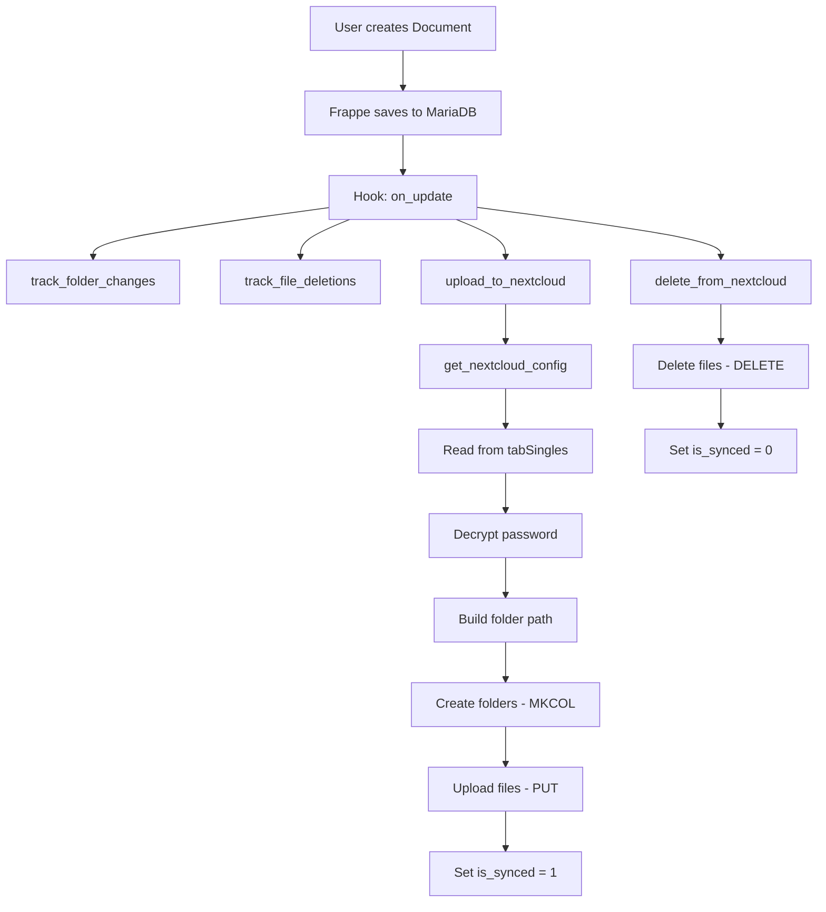

# 🏗️ Архитектура Company Documents App v0.0.2.6

**Версия:** v0.0.2.6  
**Дата:** 2025-11-26  
**Frappe:** version-15  
**ERPNext:** v15.83.0

---

## 1. Обзор проекта

**Company Documents App** - кастомное приложение для ERPNext, обеспечивающее:
- Управление документами с автоматической нумерацией
- Синхронизацию файлов с NextCloud через WebDAV
- Гибкую структуру папок (5 уровней)
- Связь документов с проектами и задачами

### Технический стек

| Компонент | Версия | Назначение |
|-----------|--------|------------|
| **Frappe Framework** | version-15 | Базовая платформа |
| **ERPNext** | v15.83.0 | ERP система |
| **HRMS** | v15.52.0 | Управление персоналом |
| **Raven** | v2.6.4 | Внутренний чат |
| **pibiDAV** | version-15 | WebDAV интеграция (базовый) |
| **Python** | 3.10+ | Язык программирования |
| **NextCloud** | latest | Облачное хранилище |

---

## 2. Структура файлов

```
company_documents/
├── __init__.py
├── hooks.py                           # Конфигурация приложения
├── nextcloud_sync.py                  # NextCloud интеграция (473 строки)
├── patches.txt                        # Миграции (пусто в v0.0.2)
├── modules.txt                        # Модули
│
├── fixtures/                          # Данные для установки
│   ├── doctype.json                   # 5 DocTypes (custom=1)
│   ├── server_script.json             # Server Scripts
│   ├── client_script.json             # 6 Client Scripts
│   ├── folder_structure_template.json # 84 шаблона (3 корневых + 81 дочерних)
│   ├── custom_field.json              # Кастомные поля
│   ├── property_setter.json           # Настройки свойств
│   ├── document_naming_rule.json      # Правила нумерации
│   └── workspace.json                 # Воркспейсы
│
├── custom/                            # Кастомные контроллеры
│   ├── __init__.py
│   └── document.py                    # validate() для Document
│
├── documents/                         # Модуль Documents
│   └── doctype/
│       ├── document/                  # DocType: Document
│       ├── document_file/             # DocType: Document File
│       ├── folder_structure_template/ # DocType: Folder Structure Template
│       └── nextcloud_sync_settings/   # DocType: NextCloud Sync Settings
│
├── projects/                          # Модуль Projects
│   └── doctype/
│       ├── task_document_link/        # DocType: Task Document Link
│       ├── project_document_type/     # DocType: Project Document Type
│       ├── task_employee/             # DocType: Task Employee
│       ├── cila_document_row/         # DocType: CILA Document Row
│       └── task_workspace_row/        # DocType: Task Workspace Row
│
├── templates/                         # Шаблоны
├── public/                           # Статические файлы
└── config/                           # Конфигурация
```

---

## 3. DocTypes (9 типов документов)

### 3.1 Основные DocTypes (5)

#### Document
**Тип:** Document  
**App:** company_documents  
**Модуль:** Documents  
**Назначение:** Основной DocType для хранения документов

**Ключевые поля:**

| Поле | Тип | Описание |
|------|-----|----------|
| `naming_series` | Select | Автоматическая нумерация (DOC-.YYYY.-) |
| `project` | Link (Project) | Связь с проектом |
| `task` | Link (Task) | Связь с задачей |
| `status` | Select | Статус документа (Draft/Complete/Needs Review) |
| `level_1` - `level_5` | Link (FST) | 5 уровней структуры папок |
| `files` | Table (Document File) | Таблица файлов |
| `readiness_status` | Select | Статус готовности (missing/partial/approved/...) |
| `files_count` | Int | **Авто-расчёт:** количество файлов |
| `start_date` | Date | Дата начала работы |
| `planned_days` | Int | Планируемые дни |
| `planned_end_date` | Date | **Авто-расчёт:** start_date + planned_days |
| `due_date` | Date | Крайний срок |
| `overdue` | Check | **Авто-расчёт:** просрочен ли документ |
| `responsible_employee` | Link (Employee) | Ответственный сотрудник |
| `is_synced` | Check | Синхронизирован с NextCloud |

**Автоматические расчёты (validate hook):**
```python
# company_documents/custom/document.py
def validate(doc, method):
    # planned_end_date = start_date + planned_days
    if doc.start_date and doc.planned_days:
        doc.planned_end_date = add_days(doc.start_date, doc.planned_days)
    
    # files_count = количество файлов
    doc.files_count = len(doc.files) if doc.files else 0
    
    # overdue = просрочен если today > due_date и не approved
    effective_due = doc.due_date or doc.planned_end_date
    if effective_due:
        is_overdue = (getdate(today()) > getdate(effective_due) 
                     and doc.readiness_status != "approved")
        doc.overdue = 1 if is_overdue else 0
```

**Hooks (events):**
```python
doc_events = {
    "Document": {
        "validate": [
            "company_documents.custom.document.validate"
        ],
        "on_update": [
            "company_documents.nextcloud_sync.track_folder_changes",
            "company_documents.nextcloud_sync.track_file_deletions",
            "company_documents.nextcloud_sync.upload_to_nextcloud",
            "company_documents.nextcloud_sync.delete_from_nextcloud"
        ]
    }
}
```

#### Document File
**Тип:** Child Table  
**App:** company_documents  
**Модуль:** Documents  
**Назначение:** Хранение файлов документа

**Ключевые поля:**

| Поле | Тип | Описание |
|------|-----|----------|
| `file` | Attach | Прикрепленный файл |
| `file_name` | Data | Имя файла |
| `file_url` | Data | URL файла в NextCloud (с file_id) |
| `file_synced` | Check | Флаг синхронизации |
| `uploaded_by` | Link (User) | Кто загрузил |
| `uploaded_on` | Datetime | Когда загружено |

**Формат file_url (v0.0.2.6+):**
```
https://cloud.example.com/apps/files/files/123456?dir=/Projects/Test&openfile=true
```
- `123456` - file_id из NextCloud PROPFIND
- `openfile=true` - открывает файл напрямую, а не папку

#### Folder Structure Template
**Тип:** Document (Tree/Nested Set)  
**App:** company_documents  
**Модуль:** Documents  
**Назначение:** Шаблоны структуры папок

**Количество шаблонов:** 84 (3 корневых + 81 дочерних)

**Структура:**
- 3 корневых элемента: Progettazione, Realizzazione, Amministrativi
- Иерархия до 5 уровней вложенности
- **Важно:** Использует Nested Set - порядок в JSON критичен (родители перед детьми)

#### NextCloud Sync Settings
**Тип:** Single  
**App:** company_documents  
**Модуль:** Documents  
**Назначение:** Настройки синхронизации с NextCloud

⚠️ **ВАЖНО:** Хранится в `tabSingles`, НЕ в отдельной таблице!

**Ключевые поля:**

| Поле | Тип | Описание |
|------|-----|----------|
| `enabled` | Check | Включить синхронизацию |
| `nc_url` | Data | URL NextCloud (https://cloud.example.com) |
| `nc_username` | Data | Имя пользователя NextCloud |
| `nc_password` | Password | Пароль (зашифрован AES-256) |
| `nc_root_path` | Data | Корневой путь (опционально) |

**Шифрование пароля:**
```python
from frappe.utils.password import get_decrypted_password

nc_password = get_decrypted_password(
    "NextCloud Sync Settings", 
    "NextCloud Sync Settings", 
    "nc_password", 
    raise_exception=False
)
```

#### Task Document Link
**Тип:** Document  
**App:** company_documents  
**Модуль:** Projects  
**Назначение:** Связь задач с документами

---

### 3.2 Вспомогательные DocTypes (4)

#### Project Document Type
**Назначение:** Типы документов для проектов

#### Task Employee
**Назначение:** Назначение сотрудников на задачи

#### CILA Document Row
**Назначение:** Строки CILA документов (legacy)

#### Task Workspace Row
**Назначение:** Воркспейсы задач

---

## 4. Структура hooks.py

```python
app_name = "company_documents"
app_title = "Company Documents"
app_version = "0.0.2.6"

# Document Events - validate + 4 функции on_update
doc_events = {
    "Document": {
        "validate": [
            "company_documents.custom.document.validate"  # Авто-расчёты
        ],
        "on_update": [
            "company_documents.nextcloud_sync.track_folder_changes",
            "company_documents.nextcloud_sync.track_file_deletions",
            "company_documents.nextcloud_sync.upload_to_nextcloud",
            "company_documents.nextcloud_sync.delete_from_nextcloud"
        ]
    }
}

# Fixtures - экспорт данных (v0.0.2.6: фильтр по app)
fixtures = [
    # DocTypes - фильтр по app (не по module!)
    {"dt": "DocType", "filters": [["app", "=", "company_documents"]]},
    
    # Server Scripts - фильтр по module
    {"dt": "Server Script", "filters": [["module", "=", "Documents"]]},
    
    # Client Scripts - фильтр по dt (наши DocTypes)
    {"dt": "Client Script", "filters": [
        ["dt", "in", ["Document", "Document File", "NextCloud Sync Settings", "Folder Structure Template"]]
    ]},
    
    # Custom Fields / Property Setters
    {"dt": "Custom Field", "filters": [["module", "=", "Documents"]]},
    {"dt": "Property Setter", "filters": [["module", "=", "Documents"]]},
    
    # Все Folder Structure Templates (84 записи)
    {"dt": "Folder Structure Template"},
    
    # Document Naming Rule
    {"dt": "Document Naming Rule", "filters": [["document_type", "=", "Document"]]},
    
    # Workspace
    {"dt": "Workspace", "filters": [["title", "=", "Documents App"]]}
]
```

**Важные изменения v0.0.2.6:**
- ✅ Добавлен `validate` event для авто-расчётов
- ✅ Фильтр DocTypes по `app` (не по `module`) - экспортирует только наши 5 DocTypes
- ✅ Все DocTypes имеют `custom=1` для совместимости без developer_mode

---

## 5. Server Scripts (5)

Server Scripts выполняются на сервере при определенных событиях.

**Включение Server Scripts в v15:**
```bash
bench set-config -g server_script_enabled 1
```

⚠️ **КРИТИЧНО:** Флаг `-g` обязателен в v15!

---

## 6. Client Scripts (7)

Client Scripts выполняются в браузере пользователя.

**Типы событий:**
- Form events
- List events
- Custom buttons

---

## 7. NextCloud Sync - Архитектура

### 7.1 Функции в nextcloud_sync.py

**Основные функции:**

1. **get_nextcloud_config()** - получение настроек из Single DocType
2. **get_nextcloud_file_id()** - получение file_id через WebDAV PROPFIND (v0.0.2.6+)
3. **track_folder_changes()** - отслеживание изменений папок
4. **track_file_deletions()** - отслеживание удаления файлов
5. **upload_to_nextcloud()** - загрузка файлов в NextCloud
6. **delete_from_nextcloud()** - удаление файлов из NextCloud
7. **sync_document_to_nextcloud()** - ручная синхронизация (whitelist)

### 7.2 Новое в v0.0.2.6: Direct File Links

**Функция get_nextcloud_file_id():**
```python
def get_nextcloud_file_id(file_path, config):
    """
    Получить file_id файла в NextCloud через WebDAV PROPFIND.
    
    Поддержка двух namespace:
    - oc:fileid (OwnCloud / старый NextCloud)
    - nc:fileid (NextCloud 25+)
    """
    propfind_xml = '''<?xml version="1.0"?>
    <d:propfind xmlns:d="DAV:" xmlns:oc="http://owncloud.org/ns" xmlns:nc="http://nextcloud.org/ns">
      <d:prop><oc:fileid/><nc:fileid/></d:prop>
    </d:propfind>'''
    
    response = requests.request('PROPFIND', url, data=propfind_xml, ...)
    # Парсинг XML → возвращает file_id (str) или None
```

**Формат file_url:**
- **До v0.0.2.6:** `https://cloud/apps/files/?dir=/Projects/Test` ❌ (папка)
- **С v0.0.2.6:** `https://cloud/apps/files/files/123456?openfile=true` ✅ (файл)

### 7.3 WebDAV операции

```python
# PROPFIND - получение file_id
response = requests.request('PROPFIND', file_url, data=propfind_xml, auth=auth)

# MKCOL - создание папки
response = requests.request('MKCOL', folder_url, auth=auth)

# PUT - загрузка файла
with open(local_path, 'rb') as f:
    response = requests.put(file_url, data=f, auth=auth)

# MOVE - перемещение
headers = {'Destination': new_url}
response = requests.request('MOVE', old_url, headers=headers, auth=auth)

# DELETE - удаление
response = requests.delete(file_url, auth=auth)
```

### 7.3 Структура путей в NextCloud

```
NextCloud/
└── remote.php/dav/files/USERNAME/
    └── [ROOT_PATH]/
        └── Projects/
            └── ProjectName/
                └── Level1/
                    └── Level2/
                        └── Level3/
                            └── Level4/
                                └── Level5/
                                    └── file.pdf
```

---

## 8. Автоматическая нумерация

**Формат:** `DOC-.YYYY.-`

**Примеры:**
- DOC-2025-00001
- DOC-2025-00002
- DOC-2026-00001 (новый год - сброс счетчика)

**Настройка:** Document Naming Rule

---

## 9. Диаграмма работы



---

## 10. Безопасность

### 10.1 Шифрование паролей

**NextCloud пароль:**
- Хранится зашифрованным в `tabSingles`
- Шифрование: AES-256
- Расшифровка: `frappe.utils.password.get_decrypted_password()`

### 10.2 Доступ к API

**WebDAV аутентификация:**
```python
from requests.auth import HTTPBasicAuth
auth = HTTPBasicAuth(username, password)
```

---

## 12. API Module (v0.0.2.6+)

### 12.1 Файл: company_documents/api.py

Канонические методы для всех UI компонентов приложения.

**Доступные методы:**

| Метод | Назначение |
|-------|------------|
| `get_project_document_overview(project)` | Flat-список документов с `files[]` |
| `get_project_document_tree(project)` | Иерархия по level_1..5 для Tree View |
| `create_test_data(project, count)` | Создание тестовых данных |
| `cleanup_test_data(project)` | Удаление тестовых данных |

### 12.2 Оптимизация

Все методы используют **2 SQL запроса** вместо N+1:
1. Запрос 1: Все документы проекта
2. Запрос 2: Все файлы одним запросом

**Производительность:**
- 50 документов: ~3 ms
- 150 документов: ~7 ms
- 500 документов: ~20 ms

### 12.3 Использование

```python
# Python
from company_documents.api import get_project_document_overview
docs = get_project_document_overview("PROJ-0001")
```

```javascript
// JavaScript
frappe.call({
    method: 'company_documents.api.get_project_document_overview',
    args: { project: 'PROJ-0001' },
    callback: (r) => console.log(r.message)
});
```

📚 **Полная документация:** [API.md](API.md)

---

## 13. База данных

### 11.1 Основные таблицы

- `tabDocument` - документы
- `tabDocument File` - файлы документов
- `tabFolder Structure Template` - шаблоны
- `tabSingles` - настройки NextCloud (Single DocType)
- `tabTask Document Link` - связи задач

### 11.2 Single DocType хранение

**tabSingles структура:**
```sql
CREATE TABLE `tabSingles` (
  `doctype` varchar(255) NOT NULL,
  `field` varchar(255) NOT NULL,
  `value` text,
  PRIMARY KEY (`doctype`, `field`)
);
```

**Пример данных:**
```sql
INSERT INTO tabSingles VALUES
('NextCloud Sync Settings', 'enabled', '1'),
('NextCloud Sync Settings', 'nc_url', 'https://cloud.example.com'),
('NextCloud Sync Settings', 'nc_username', 'admin'),
('NextCloud Sync Settings', 'nc_password', 'encrypted_password_hash');
```

---

## 14. Производительность

### 12.1 Оптимизация

- Асинхронная загрузка файлов
- Кэширование настроек NextCloud
- Пакетная обработка файлов

### 12.2 Ограничения

- Максимальный размер файла: определяется NextCloud
- Количество файлов: не ограничено
- Глубина вложенности: 5 уровней

---

## 15. Интеграция с ERPNext

### 13.1 Связи

- **Project** → Document (Link field)
- **Task** → Document (через Task Document Link)

### 13.2 Воркспейсы

- **Documents app** - кастомный воркспейс

---

## 16. Дальнейшее развитие

### Планируемые функции:
- [ ] Tree View Custom Page для визуализации
- [ ] Script Report для Document overview
- [ ] Версионирование документов
- [ ] Шаблоны документов
- [ ] Массовая загрузка файлов
- [ ] Интеграция с электронной подписью

---

## Ссылки

- **[API.md](API.md)** - API Reference (методы для UI)
- **[DOCUMENT_LOGIC.md](DOCUMENT_LOGIC.md)** - логика DocType Document
- **[DEVELOPMENT.md](DEVELOPMENT.md)** - процесс разработки
- **[NEXTCLOUD_SYNC.md](NEXTCLOUD_SYNC.md)** - детали синхронизации
- **[FIXTURES.md](FIXTURES.md)** - конфигурация fixtures
- **[../knowledge.md](../knowledge.md)** - база знаний

---

**Последнее обновление:** 2025-11-26
