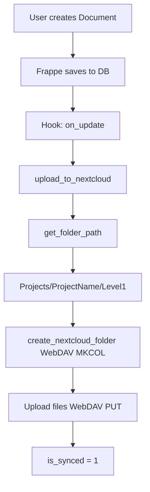

# 🏗️ Архитектура Company Documents App

## 1. Frappe Framework

ERPNext построен на **Frappe** — Python-фреймворк для бизнес-приложений.

**Основные концепции:**

- **DocType** — тип документа (структура данных)
- **Doc** — экземпляр DocType (запись в БД)
- **Hooks** — автоматизация
- **Fixtures** — данные для экспорта/импорта

## 2. NextCloud Sync

При сохранении Document:

1. `get_folder_path()` — строит путь: `Projects/ProjectName/Level1/...`
2. `create_nextcloud_folder()` — создаёт папки (WebDAV MKCOL)
3. `upload_to_nextcloud()` — загружает файлы (WebDAV PUT)
4. `is_synced` → 1

## 3. WebDAV

Протокол для работы с файлами:

- `MKCOL` — создать папку
- `PUT` — загрузить файл
- `MOVE` — переместить
- `DELETE` — удалить

## 4. Диаграмма работы

---

**Подробнее:** см. `company_documents/nextcloud_sync.py`
