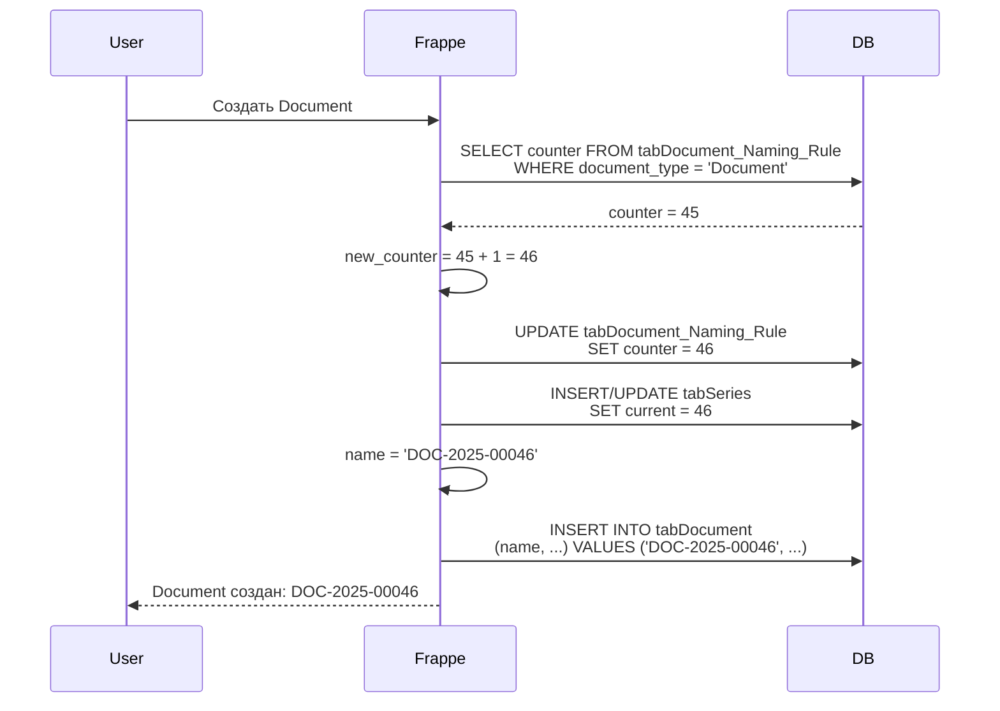

# 🔢 Механизм нумерации документов в Frappe v15

**Версия:** v0.0.2.4  
**Дата:** 2025-11-23  
**Назначение:** Техническое описание системы автоматической нумерации документов

---

## 📋 Содержание

1. [Общая концепция](#1-общая-концепция)
2. [Иерархия источников счётчика](#2-иерархия-источников-счётчика)
3. [Алгоритм генерации номера](#3-алгоритм-генерации-номера)
4. [Таблицы БД](#4-таблицы-бд)
5. [Типичные проблемы](#5-типичные-проблемы)
6. [Процедуры управления](#6-процедуры-управления)

---

## 1. Общая концепция

### 1.1 Что такое Document Naming Rule

**Document Naming Rule** - DocType в Frappe для настройки автоматической нумерации документов.

**Назначение:**
- Генерация уникальных номеров (ID) для документов
- Поддержка шаблонов с датами, счётчиками, сериями
- Контроль порядка нумерации

**Пример:**
```
Правило: DOC-.YYYY.-
Результат: DOC-2025-00001, DOC-2025-00002, ...
```

### 1.2 Компоненты номера

| Компонент | Описание | Пример |
|-----------|----------|--------|
| Prefix | Фиксированный префикс | `DOC-` |
| Year | Год создания | `.YYYY.` → `2025` |
| Separator | Разделитель | `-` |
| Counter | Порядковый номер | `00001` (с ведущими нулями) |

**Итоговый формат:** `DOC-2025-00001`

---

## 2. Иерархия источников счётчика

### 2.1 Три уровня хранения

```
┌─────────────────────────────────────────────────────────────┐
│  1. Document Naming Rule.counter (PostgreSQL/MariaDB)       │
│     Таблица: tabDocument Naming Rule                        │
│     Поле: counter (INT)                                     │
│     ★ ГЛАВНЫЙ ИСТОЧНИК ПРАВДЫ ★                             │
└─────────────────────────────────────────────────────────────┘
                            ↓
┌─────────────────────────────────────────────────────────────┐
│  2. tabSeries (PostgreSQL/MariaDB)                          │
│     Таблица: tabSeries                                      │
│     Поля: name (VARCHAR), current (INT)                     │
│     Назначение: Кэш для быстрого доступа                    │
└─────────────────────────────────────────────────────────────┘
                            ↓
┌─────────────────────────────────────────────────────────────┐
│  3. Python memory cache (Redis/in-memory)                   │
│     Живёт только в процессе backend/worker                  │
│     Очищается при перезапуске контейнера                    │
└─────────────────────────────────────────────────────────────┘
```

### 2.2 Приоритет при чтении

**Frappe всегда читает ИЗ ВЕРХНЕГО УРОВНЯ:**

1. Проверяет Document Naming Rule.counter
2. Инкрементирует значение
3. Сохраняет в БД
4. Обновляет tabSeries
5. Кэширует в память

**⚠️ ВАЖНО:** Удаление из `tabSeries` или очистка кэша **НЕ влияет** на счётчик!

---

## 3. Алгоритм генерации номера

### 3.1 Пошаговый процесс

```python
# Псевдокод алгоритма Frappe
def generate_document_name(doctype):
    # 1. Найти правило нумерации
    rule = frappe.db.get_value("Document Naming Rule", 
        filters={"document_type": doctype},
        fieldname=["name", "prefix", "counter", "prefix_digits"])
    
    if not rule:
        raise Exception(f"No naming rule for {doctype}")
    
    # 2. Инкрементировать счётчик
    new_counter = rule.counter + 1
    
    # 3. Сохранить новый счётчик в Document Naming Rule
    frappe.db.set_value("Document Naming Rule", rule.name, "counter", new_counter)
    
    # 4. Разобрать префикс (заменить .YYYY. на текущий год)
    from datetime import datetime
    prefix_parsed = rule.prefix.replace(".YYYY.", f"-{datetime.now().year}-")
    
    # 5. Форматировать номер с ведущими нулями
    counter_formatted = str(new_counter).zfill(rule.prefix_digits)  # 00001
    
    # 6. Собрать итоговое имя
    name = f"{prefix_parsed}{counter_formatted}"
    
    # 7. Обновить tabSeries (для кэша)
    series_key = f"{prefix_parsed}"
    frappe.db.sql("""
        INSERT INTO tabSeries (name, current) VALUES (%s, %s)
        ON DUPLICATE KEY UPDATE current = %s
    """, (series_key, new_counter, new_counter))
    
    return name  # DOC-2025-00001
```

### 3.2 Диаграмма процесса



---

## 4. Таблицы БД

### 4.1 tabDocument Naming Rule

**Структура:**
```sql
CREATE TABLE `tabDocument Naming Rule` (
  `name` VARCHAR(140) PRIMARY KEY,
  `document_type` VARCHAR(140),
  `prefix` VARCHAR(140),
  `prefix_digits` INT,
  `counter` INT DEFAULT 0,
  `priority` INT DEFAULT 0,
  `disabled` TINYINT DEFAULT 0,
  `conditions` TEXT,
  `modified` DATETIME
);
```

**Пример записи:**
```sql
SELECT * FROM `tabDocument Naming Rule` 
WHERE document_type = 'Document';
```

| name | document_type | prefix | prefix_digits | counter | disabled |
|------|---------------|--------|---------------|---------|----------|
| r66srbpmvh | Document | DOC-.YYYY.- | 5 | 45 | 0 |

### 4.2 tabSeries

**Структура:**
```sql
CREATE TABLE `tabSeries` (
  `name` VARCHAR(100) PRIMARY KEY,
  `current` INT DEFAULT 0
);
```

**Пример записи:**
```sql
SELECT * FROM `tabSeries` WHERE name LIKE 'DOC%';
```

| name | current |
|------|---------|
| DOC-2025- | 45 |

**Назначение:** Кэш для быстрого доступа к текущему значению счётчика без JOIN к Document Naming Rule.

### 4.3 Связь между таблицами

```
tabDocument Naming Rule (1)
          ↓
     uses prefix
          ↓
    tabSeries (N)
```

**Пример:**
- Document Naming Rule: `prefix = "DOC-.YYYY.-"`
- tabSeries: `name = "DOC-2025-"`, `name = "DOC-2024-"`, ...
- **Для каждого года создаётся своя запись в tabSeries**

---

## 5. Типичные проблемы

### 5.1 Проблема: Нумерация не сбрасывается

**Симптомы:**
```bash
# Удалили все документы
DELETE FROM `tabDocument`;

# Удалили счётчик
DELETE FROM `tabSeries` WHERE name LIKE 'DOC-%';

# Создали новый документ
# Ожидаем: DOC-2025-00001
# Получаем: DOC-2025-00046  ❌
```

**Причина:**

Frappe читает `counter = 45` из **Document Naming Rule**, который НЕ был удалён!

**Решение:**

```python
# Удалить Document Naming Rule целиком
frappe.delete_doc("Document Naming Rule", "r66srbpmvh", force=1)

# Создать новый с counter=0
naming_rule = frappe.get_doc({
    "doctype": "Document Naming Rule",
    "document_type": "Document",
    "prefix": "DOC-.YYYY.-",
    "prefix_digits": 5,
    "counter": 0,  # ← СБРОС!
    "disabled": 0
})
naming_rule.insert()
frappe.db.commit()
```

### 5.2 Проблема: После перезапуска backend номер продолжает расти

**Симптомы:**
```bash
# До перезапуска: DOC-2025-00045
docker compose restart backend
# После перезапуска: DOC-2025-00046  ← продолжает с того же места
```

**Причина:**

Счётчик хранится в **БД** (Document Naming Rule), не в памяти!

**Это НОРМАЛЬНО:** Счётчик должен продолжаться после перезапуска.

### 5.3 Проблема: Fixture импортирует старый счётчик

**Симптомы:**
```bash
# Переустановили сайт
docker compose down -v
docker compose up -d

# Создали Document
# Получаем: DOC-2025-00046  ← счётчик из fixture!
```

**Причина:**

Файл `document_naming_rule.json` содержит:
```json
{
  "counter": 45,  ← ЗНАЧЕНИЕ ИЗ РАЗРАБОТКИ!
  ...
}
```

**Решение для development:**

Сбросить счётчик вручную после установки (см. раздел 6.2).

**Решение для production:**

Перед релизом:
```bash
# Открыть fixture
nano company_documents/fixtures/document_naming_rule.json

# Изменить
{
  "counter": 0,  ← ПРАВИЛЬНОЕ ЗНАЧЕНИЕ!
  ...
}

# Закоммитить
git commit -m "fix: Reset counter for v1.0.0"
```

---

## 6. Процедуры управления

### 6.1 Проверить текущий счётчик

```bash
cd ~/frappe_docker_TEST

# Через SQL
DB_NAME=$(docker compose exec -T backend cat /home/frappe/frappe-bench/sites/localhost/site_config.json | grep -oP '"db_name":\s*"\K[^"]+')

docker compose exec db mysql -u root -p123 -e "
USE \`$DB_NAME\`;
SELECT name, document_type, prefix, counter 
FROM \`tabDocument Naming Rule\` 
WHERE document_type = 'Document';
"

# Через Python
docker compose exec -T backend bash -c 'cd /home/frappe/frappe-bench && bench --site localhost console << '\''EOF'\''
import frappe
rules = frappe.get_all("Document Naming Rule", 
    filters={"document_type": "Document"}, 
    fields=["name", "counter", "prefix", "disabled"])
for r in rules:
    print(f"{r.name}: counter={r.counter}, prefix={r.prefix}")
EOF'
```

### 6.2 Сбросить счётчик до 0

```bash
cd ~/frappe_docker_TEST

cat > reset_counter.py << 'PYTHON'
import frappe

frappe.init(site='localhost')
frappe.connect()
frappe.set_user('Administrator')

# Получить все Document Naming Rules для Document
rules = frappe.get_all("Document Naming Rule", 
    filters={"document_type": "Document"}, 
    fields=["name"])

# Удалить все старые правила
for r in rules:
    frappe.delete_doc("Document Naming Rule", r.name, force=1)
    print(f"✓ Deleted: {r.name}")

# Создать новое с counter=0
naming_rule = frappe.get_doc({
    "doctype": "Document Naming Rule",
    "document_type": "Document",
    "prefix": "DOC-.YYYY.-",
    "prefix_digits": 5,
    "counter": 0,
    "disabled": 0,
    "priority": 0,
    "conditions": []
})
naming_rule.insert()
print(f"✓ Created: {naming_rule.name} with counter=0")

frappe.db.commit()
PYTHON

docker cp reset_counter.py frappe_docker_test-backend-1:/tmp/
docker compose exec -T backend bash -c 'cd /home/frappe/frappe-bench && bench --site localhost console < /tmp/reset_counter.py'
rm reset_counter.py

echo "✅ Счётчик сброшен! Следующий Document будет DOC-2025-00001"
```

### 6.3 Установить счётчик на конкретное значение

```bash
cd ~/frappe_docker_TEST

# Установить counter = 100
docker compose exec -T backend bash -c 'cd /home/frappe/frappe-bench && bench --site localhost console << '\''EOF'\''
import frappe

rule_name = frappe.db.get_value("Document Naming Rule", 
    {"document_type": "Document"}, "name")

if rule_name:
    frappe.db.set_value("Document Naming Rule", rule_name, "counter", 100)
    frappe.db.commit()
    print(f"✓ Counter set to 100")
else:
    print("✗ No naming rule found")
EOF'
```

### 6.4 Проверить следующий номер (без создания документа)

```python
import frappe

rule = frappe.get_doc("Document Naming Rule", 
    {"document_type": "Document"})

next_number = rule.counter + 1
prefix = rule.prefix.replace(".YYYY.", f"-{frappe.utils.nowdate()[:4]}-")
next_name = f"{prefix}{str(next_number).zfill(rule.prefix_digits)}"

print(f"Следующий Document: {next_name}")
# Output: Следующий Document: DOC-2025-00046
```

---

## 7. Лучшие практики

### 7.1 Для development

✅ **DO:**
- Понимать что счётчик из fixture (например 45)
- Сбрасывать вручную если нужно начать с 1
- Не коммитить случайные изменения `counter` в fixture

❌ **DON'T:**
- Пытаться сбросить через `DELETE FROM tabSeries`
- Удалять `tabDocument` ожидая сброса счётчика
- Полагаться на перезапуск backend для сброса

### 7.2 Для production

✅ **DO:**
- Обнулить `counter` в fixture перед релизом
- Проверить что fixture содержит `counter: 0`
- Протестировать на чистой установке

❌ **DON'T:**
- Релизить с `counter` из разработки
- Менять prefix после начала использования
- Удалять Document Naming Rule в production

### 7.3 Для troubleshooting

✅ **DO:**
- Проверить Document Naming Rule.counter ПЕРВЫМ
- Использовать `frappe.delete_doc()` для удаления правила
- Коммитить перед сбросом на development

❌ **DON'T:**
- Работать напрямую с tabSeries
- Изменять counter через SQL UPDATE
- Предполагать что кэш влияет на логику

---

## 8. Полезные команды

```bash
# Показать все Document Naming Rules
docker compose exec backend bench --site localhost console << 'EOF'
import frappe
rules = frappe.get_all("Document Naming Rule", fields=["*"])
for r in rules:
    print(f"{r.document_type}: {r.prefix} (counter={r.counter})")
EOF

# Показать tabSeries
docker compose exec db mysql -u root -p123 -e "
USE \`$(docker compose exec -T backend cat /home/frappe/frappe-bench/sites/localhost/site_config.json | grep -oP '\"db_name\":\s*\"\K[^\"]+' )\`;
SELECT * FROM \`tabSeries\`;
"

# Удалить все Document
docker compose exec backend bench --site localhost console << 'EOF'
import frappe
docs = frappe.get_all("Document", pluck="name")
for d in docs:
    frappe.delete_doc("Document", d, force=1)
frappe.db.commit()
print(f"Deleted {len(docs)} documents")
EOF
```

---

**Документ создан:** 2025-11-23  
**Автор:** AI Assistant (GitHub Copilot)  
**Версия:** 1.0
